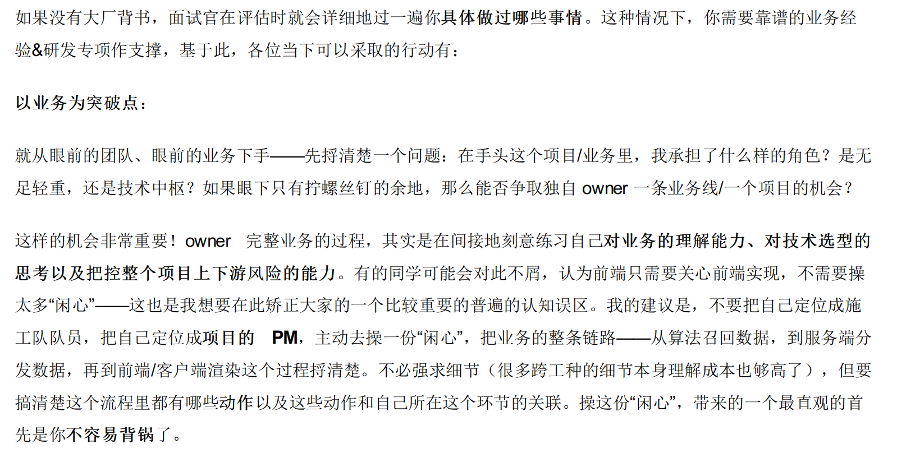
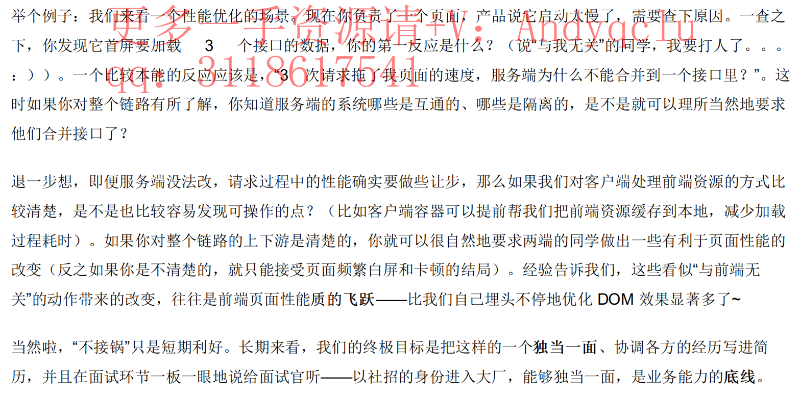
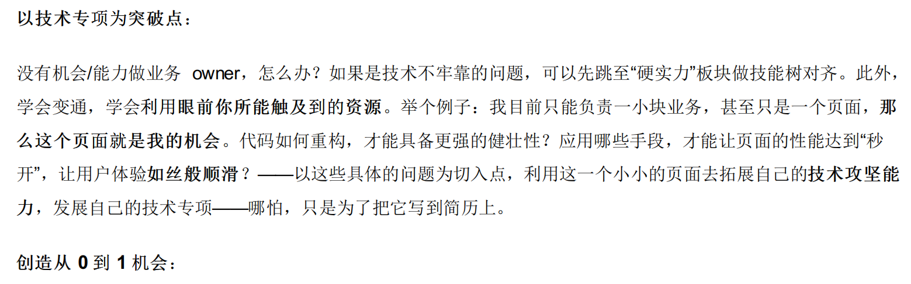
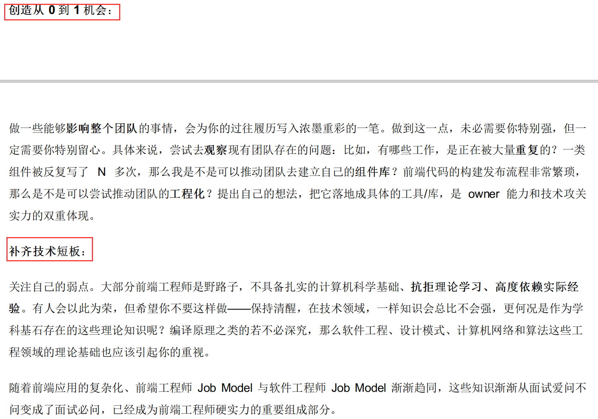

# 自我介绍

您好，我是xxx，西安电子科技大学研二在读，专业是计算机科学与技术。
今天想面试贵公司的平台工程师岗位。

在学习方面，我平常做的主要是web前端的工作，未来也希望从事相关的岗位。
虽然在大学接触过前端，但是只是跟着一些或大或小的项目，做过简单的宣传网页。
研究生阶段，实验室项目需要+个人职业意向选择，我开始系统的学习前端知识，并且参与了两个实验室的项目
一个是作为小组长主导开发的线下教育系统项目
一个是参与的关于国防地图服务发布与演示的科研项目

在工作中，我认真负责，尽量做好每一件事；在生活中，我对设计有一定的兴趣，有一定的UI基础，同时热爱分享与记录，喜欢摄影和画画。
谢谢，以上是我的自我介绍。

# 项目指导

## 项目基本问题

项目问题的话主要

* 自己来讲干了什么，中间有什么问题，自己做了什么优化了什么？ 这个系统在代码方面有哪些不合理的地方？哪里可以继续优化？
* 一般会让自己挑一个项目描述，我当时讲保障库多一点，一般就问做项目中遇到最大的问题是什么。还有一些设计架构，为什么这么设计…反正感觉项目主要靠自己吹 

## **简历中的项目思考**

# 项目1：OES

## 项目介绍

当下，线下的中小型教育机构的报名和购课，请假和补课仍采用纸质登记的方式，为做到自动化，这个系统就是为这些中小型机构设计的。分为小程序端和PC端。

**需求分析：分为五个角色，再从每个角色的功能模块说**：

* 平台管理员：所有入住机构的管理，审核和信息更新等。
* 总管理员(老板)：管理员工，查看机构下教师和学生信息，查看数据统计模块等
* 机构下普通员工：课程管理，学生管理，教室挂靠，预约与购课，请假与补课，商品管理，支付与订单管理等
* 教师：入住平台后挂靠机构，上课，补课，推送课程，课程签到管理等
* 学生: 报名单个或多个机构，上课签到，请假与申请补课，购课。支付。

## 自己做了什么

两方面：

一、技术方面

主要负责PC端的功能实现，在迭代中完善功能修改bug，配合小程序端联调。

二、非技术方面

前期负责基础功能的工作分配与测试，后期根据甲方需求，帮助明确需求的产品原型，进行整个项目的进度把控。

## 遇到的问题及如何解决

非技术方面：

**与甲方的沟通有问题，甲方很难对需要的东西有一个具体的概念，需求频繁更改导致的开发效率低**

画图，用Axure画一些原型文件，帮助他们确定想要的页面功能。

例如，在登录注册时，用户一开始需不需要绑定角色，绑定角色后下一步如何完善相应的信息，画流程图，帮助滤清思路。

技术方面：

**问题1：前端渲染，页面静态资源多，加载网站慢：**

**问题2：组件划分**

解决：

**让加载更快**

* 减少资源体积：服务器端开启gzip配置，减少文件体积，传输速度更快。

* 减少访问次数：
  * 合并代码(eg 图片合并：雪碧图)
  * 用MixIn提取公共代码逻辑，例如项目中的课程分类，省市区使用的是一套固定标准，就写在Mixin中
  * 缓存（eg 减少请求资源的次数）
  
* 使用更快的网络：CDN（eg CDN是根据区域来做服务器的处理，不同地址请求服务器的速度不一样）

  * 通过CDN的形式优化ElementUI的打包

    

**让渲染更快**

* CSS放在head，JS放在body最下面

* 尽早开始执行JS，用DOMContentLoaded触发

* 加载

  * 图片懒加载，上滑加载更多

  * elementUI组件按需加载

  * 路由懒加载

    

* 对DOM查询进行缓存

* 频繁DOM操作，合并到一起插入DOM结构

* 节流 throttle 防抖 debounce（渲染更流程，用户体验的一个优化）

## 设计架构

**后台管理系统的特点**

- 改变习惯成本低，兼容性要求不高
- UI要求较低，开发效率要求较高，直接选用组件库快速开发即可
- 对SEO无高要求

**技术选型：**

PC端：

- 语言和框架：Vue2.6+Vue-Router + Sass+Element + ES6
- 架构：前后端分离 + 分层架构 + 模块化开发（组件化开发）
  * **组件化开发**：一个功能模块一个组件，无论是修改功能还是新增功能都好上手
  * **每个角色都是一个单独的Vue工程：**一是因为静态资源多，功能负责，按角色分为多个Vue工程使得每个Vue工程会小一点，不同角色见不会重叠，例如一般管理员不需要加载教师的资源和文件。二是实验室协同开发，每人负责一个角色的子项目，便于开发。
- 辅助工具：npm + Webpack + Git
- 发布过程：环境部署（前端和后端各自一单独tomcat部署） -> 代码部署（实验室自部署Gitlab） -> nginx配置（没用） -> 域名解析（当前正在注册域名）

小程序端：

* wx小程序API

下面收集面试时遇到的所有关于项目的问题

## 1：项目中哪里用ES6

**基础知识：**

* 使用let const（顺便说其与var的区别） / 箭头函数
* 使用解构赋值（从数组和对象中提取值）
* 数组扩展：类数组/伪数组，copyWithin()、fill() inlcudes等常用方法
* 字符扩展：使用模板字符串，includes，startsWith，endsWith，repeat
* 异步编程：Promise封装ajax请求
* 模块化：export/deport

## 2：ES6转ES5

具体在项目中怎么使用babel，怎么配置

## **3：CSS预处理器**

less-loader sass-loader

## **4 ：哪些数据放在Vuex中，Vuex有哪些属性，项目中如何使用了Vuex**

1. 讲Vuex
2. 讲Vuex的几个属性
3. 在项目中的应用：员工列表放在Vuex中，用dispatch提交异步更新员工信息的操作

## 5：前后端如何交互，项目如何部署

前后端分离，使用API交互（swaggerUI的API可视化工具）。

前端独立tomcat工程。

后端独立tomcat工程。

不同角色都是一个单独的Vue工程，开发人员好上手。

## 6 ：为什么不用Ngix？

答：没学过不会用

## 7：登录注册用的什么？

登录方式：

* 账号密码登录
* 手机号验证码登录（使用的是第三方验证码服务）

用的token。

**具体使用方式？Vue工程中如何配置**

* 每次发送请求的时候都携带token
* Vue做一个路由拦截，如果没有登录就返回登陆页面。

## 8：为什么用token而不用cookie/session？

答：只知道token，其他不会（操他妈真猛）

面试官：现在用的多的仍是基于jwt的token

## 9：computed/watch/method

**说说他们的含义？**

data存储数据，computed有缓存

watch监听数据

method常用方法

**在项目中举例子哪里使用这些了？**

细化该问题！当时答的很潦草！

## 10：前后端都是HTTPS？怎么配置的？

前端在webpack里面配置开启https服务，具体也是在网上看教程的。。。。。。（答的不好）

**问了HTTPS和HTTP的区别**

基础题，答的不好。

只答了加密信息和身份认证。

**HTTPS里面有哪些协议？**

TCP/IP，SSL？不太清楚具体的。

## 11：遇到的跨域问题？项目使用的是哪种跨域解决方案？

jsonp和CROS

项目使用的是CROS，具体的答不上来

## 12：Vue工程的vue.comfig.js文件里都配置了些什么东西？

没答上来。

## 13：团队怎么分工？有几个人？如何分配工作和协调工作？

共同维护API和数据库共享文档。

PC端2人，小程序端2人，后端2人

## 14：项目的数据怎么来的？

可能是想问我虚拟mock

但是我说都是真实的测试数据

## 15：项目仍未交付?看你们做了很久了

(软件工程的内容)

甲方需求不太确定，一边做一边改。交付了一部分，用户测试使用，然后迭代开发，再交付

## 16：一个用户在两个网页登陆后同时进行操作A和B，怎么处理数据的一致性？（具体有点忘了）

妈的我根本不会这个问题。

应该是设置token并设置用户只能登录一个？

## 17 协作开发中使用git的步骤

只会讲add commit pull（merge） push

## 18 webpack热部署原理

# 项目2：bzk

## 项目介绍

web服务客户端软件。

北京吉威公司提供瓦片，项目：

1. 产品数据管理子系统：对瓦片数据的管理系统
   * 将瓦片入库（放入集群）
   * 瓦片出库，以便后续加载金字塔，发布REST风格的Web服务
2. 数据服务管理子系统：数据源配置，服务空间和服务的新建与配置
   * 数据源管理
   * 服务空间管理：新建服务空间，查看服务详细配置信息
   * *面试时，以WMTS服务为例进行具体讲解*
3. web服务展示客户端：加载具体服务，可视化展示与操作
   * 本系统的主要目的是方便用户进行针对不同类型的地理信息进行可视化展示。可以通过本系统来进行可视化操作。
   * 本系统主要包含了加载WMTS服务，WMS服务，WFS服务，WPS服务，打包下载，地名服务，目录与元数据服务等多个地理标准服务。

## 以WMS和WMTS为例

 (**OpenGIS Web Map Title Service)WMTS**提供了一种采用预\\\\定义图块方法发布数字地图服务的标准化解决方案，WMTS标砖定义了一些操作，这些操作允许用户访问切片地图。

## 自己做了什么

部署和测试，实验室的历史遗留项目，

* 去研究所安装环境与部署项目，进行项目联调。

* 修改代码与二次开发，例如对于WMTS服务，WMTS服务包含的三个操作，通过这三个操作可以实现对WMTS服务的读取。

  1. GetCapabilities操作，获取服务的元信息
  2. GetTile操作，获取切片；
  3. GetFeatureInfo：获取点选的要素信息

  后台GetCapabilities接口返回数据改变，修改前端页面逻辑让元数据信息展示出来。

## 遇到的问题及如何解决

**技术方面：**

* 返回信息的格式有很多，有文本形式，还有xml描述文档，JSON格式信息，GeoJSON等，在前端解析比较复杂。
* 在网页浏览器中显示地图，WMS直接返回图像（较简单），WMTS返回切片，采用连接的方式加载瓦片（较复杂）

解决: 一边学习一边实践，学习瓦片坐标的计算，阅读openlayers3瓦片加载源码。

**非技术方面**

* web GIS入门的门槛高，项目结构复杂，难以上手。
* 实验室历史项目，AngularJS

解决：多问师兄师姐，先了解系统功能，再从需求功能修改入手看代码。

## 设计架构

# 职业发展问题

简单的介绍一下你自己，你知道哪些技术

## 介绍一下前端的学习经历

## 作为一个专业的前端，你觉得应该掌握哪些知识

**什么时候接触前端** 

大学接触过，跟着互联网+的创新项目做过简单的宣传网页。

研究生，实验室项目需要+个人职业意向选择，志向成为一名前端工程师。

## **大学学过哪些编程的课**

操作系统，计算机组成原理，计算机网络，算法导论，数据结构

C++程序设计，Java程序设计

选择前端的原因

兴趣使然，职业成就感强

对未来三年职业的规划

基础要求目前仍是学生项目，上班后熟悉公司业务开发流程，成为一个合格的前端开发工程师

进阶要求成为一名全栈工程师

你一般是通过什么方式学习前端的？

基础学习：通过视频教程，W3school等网站，阮一峰博客，书籍。

查漏补缺：以问题导向再GitHub，掘金，segmentfault等交流平台搜索答案。

实践中摸索：根据实验室项目学习相关内容，拓宽知识面。

你还有什么我没问到的优势吗

看过什么书

学习阅读：《JS高程》《图解HTTP》《算法导论》《数据通讯与网络》。。。(大学课本)

资料查阅：《CSS权威指南》《Javascript DOM编程艺术》

有没有一页一页看？

比较厉害的技术

你认为一名前端工程师应该具备什么特点？一般是和产品，ui沟通做页面还是直接把图

如果直接按照图来做，有没有遇到过页面上实现不了的功能？遇到这样的问题怎么进行处理？

 尽量实现，不行的话只能做一些阉割版的功能。

 

## 请简述你对xx工作的理解

对岗位的理解

1. 进行通用软件开发，具体研发内容要根据业务需求来定。
2. 任务分配后，与产品，设计，前后端，运营人员合作进行项目开发。
3. 需要有一定技术能力的多面手人才：平台开发的产品要不断进行迭代，技术发展迅速，需要团队成员持续学习提高产出效率；产品团队人员或多或少，需要成员间积极保持沟通和分享。

## 应聘本职位的优势所在

对岗位的理解

1. 工作认真负责：有一定的前端技术和计算机基础，目标是成为一名合格的前端工程师。
2. 具有良好的沟通和协调能力：本科期间参与多个组织和社团，研究生期间在项目中也负责领导小组和主导需求落地
3. 持续学习&兴趣广泛：对技术和设计感兴趣，具有一定的UI设计基础。

## 学习方式

学习途径：

1. 基础学习：通过视频教程，w3school等网站，博客，阅读书籍等夯实技术基础。
2. 查漏补缺：以问题为导向，在GitHub，掘金，segmentfault等交流平台搜索答案.
3. 实践中摸索：根据实验室项目学习相关内容，拓宽知识面。

常去网站：

慕课网，w3school，CSDN，掘金，知乎，Github，segmentfault，阮一峰博客等

看书的话，你是怎么判断书上的知识一定是对的？

高程上面你觉得有什么地方是比较难理解的？ 

学过哪些框架？

你理解的框架

##  个人的优缺点

